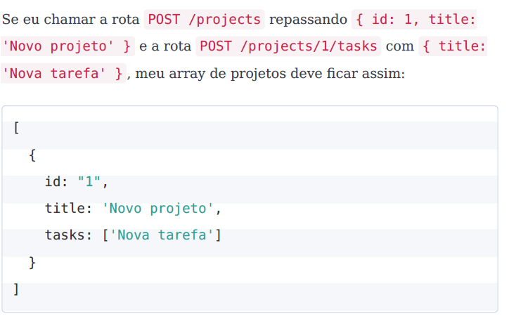

# Desafio 1
O desafio proposto pelo curso se trata de criar uma aplicação do zero utilizando Express.

Se trata de uma aplicação para armazenar projetos e suas tarefas.

### Rotas

- POST/*projects* => recebe um **id** e um **title** para cadastrar um novo projeto.
- GET/*projects* => lista todos os projetos
- PUT/*projects/:id* => altera o título do projeto com o **id** presente no parâmetro
- DELETE/*projects/:id* => deleta o projeto com o **id** presente no parâmetro
- POST/*projects/:id/tasks* => armazena uma nova tarefa no array de tarefas de um projeto com através do **id** recebido

### Exemplo

S

### Middlewares

- Possui um middleware em todas as rotas que possuem um id no parâmetro da URL e verifica se o projeto com esse ID existe.
- Imprime um (*console.log*) com a contagem de requisições que foram feitas até o momento.